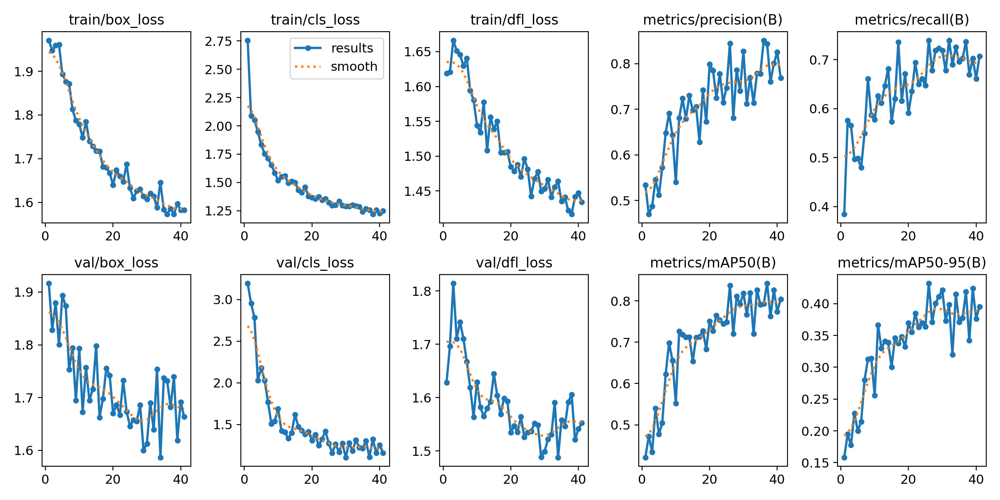
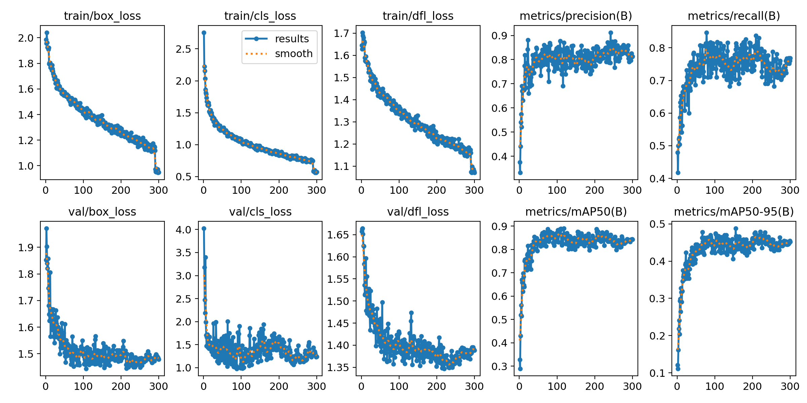
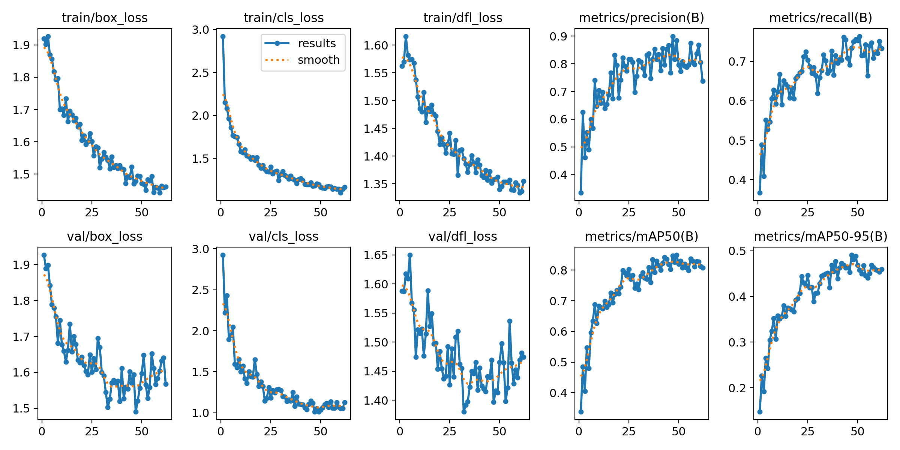
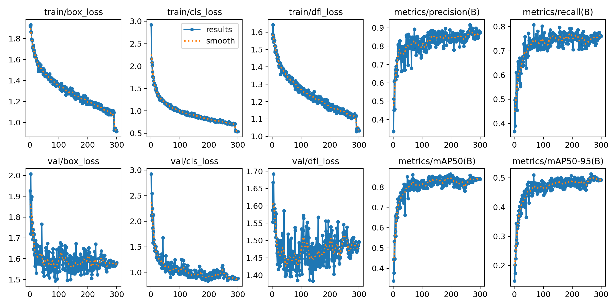
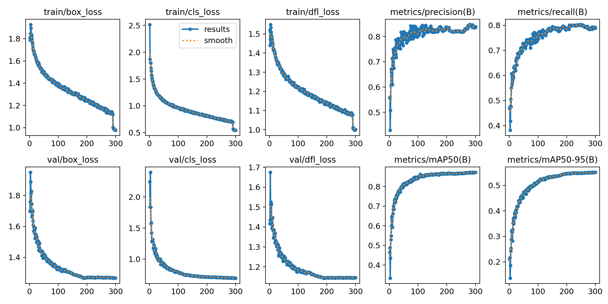
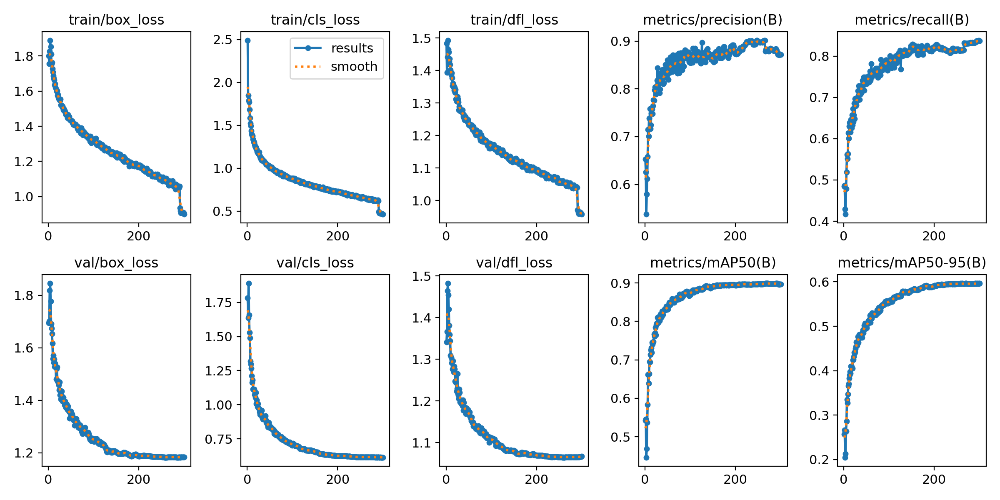

# 🔥 Phát hiện cháy trong nhà bằng YOLO

Folder này trình bày hướng dẫn train YOLO để phát hiện đám cháy trong nhà trong thời gian thực.

---

## 📑 Mục lục

- [📂 Bước 1: Chuẩn bị dữ liệu](#📂-bước-1-chuẩn-bị-dữ-liệu)
  - [🖼️ Thu thập dữ liệu](#🖼️-thu-thập-dữ-liệu)
    - [🔹 Chất lượng dữ liệu](#🔹-chất-lượng-dữ-liệu)
    - [🔹 Sự đa dạng về dữ liệu](#🔹-sự-đa-dạng-về-dữ-liệu)
    - [🔹 Cân bằng dữ liệu](#🔹-cân-bằng-dữ-liệu)
  - [📊 Nguồn dữ liệu và đánh nhãn](#📊-nguồn-dữ-liệu-và-đánh-nhãn)
- [🧩 Bước 2: Kiến trúc model](#🧩-bước-2-kiến-trúc-model)
  - [⚡ YOLOv11n](#⚡-yolov11n)
  - [🎯 Lý do lựa chọn YOLOv11n cho project](#🎯-lý-do-lựa-chọn-yolov11n-cho-project)
- [🛠️ Bước 3: Huấn luyện](#🛠️-bước-3-huấn-luyện)
  - [📂 Cấu trúc project](#📂-cấu-trúc-project)
  - [📂 Cấu trúc dữ liệu](#📂-cấu-trúc-dữ-liệu)
  - [📜 File train.py](#📜-file-trainpy)
  - [📋 Ý nghĩa Hyperparameter](#📋-ý-nghĩa-hyperparameter)
  - [⚠️ Lưu ý khi huấn luyện](#⚠️-lưu-ý-khi-huấn-luyện)
- [📈 Bước 4: Đánh giá model](#📈-bước-4-đánh-giá-model)
  - [🧮 Ý nghĩa của các thông số](#🧮-ý-nghĩa-của-các-thông-số)
    - [📉 box_loss - Bounding Box Loss](#📉-box_loss---bounding-box-loss)
    - [📉 cls_loss - Classification Loss](#📉-cls_loss---classification-loss)
    - [📉 dfl_loss - Distribution Focal Loss](#📉-dfl_loss---distribution-focal-loss)
    - [🎯 Precision - Độ chính xác](#🎯-precision---độ-chính-xác)
    - [🎯 Recall - Độ bao phủ](#🎯-recall---độ-bao-phủ)
    - [📊 mAP@0.5 - Mean Average Precision](#📊-map05---mean-average-precision)
    - [📊 mAP@0.5:0.95 – Trung bình AP từ IoU 0.5 đến 0.95](#📊-map05095--trung-bình-ap-từ-iou-05-đến-095)
  - [📝 Bảng metric tóm tắt kết quả model](#📝-bảng-metric-tóm-tắt-kết-quả-model)
- [🎥 Bước 5: Demo](#🎥-bước-5-demo)
- [🚀 Bước 6: Nâng cao chất lượng model](#🚀-bước-6-nâng-cao-chất-lượng-model)
  - [✨ Nâng cao Precision](#✨-nâng-cao-precision)
  - [🔍 Nâng cao Recall](#🔍-nâng-cao-recall)

### 📂 Bước 1: Chuẩn bị dữ liệu

- **Những nhãn xuất hiện là gì?**
- **Nguồn ảnh cần như thế nào?**

#### 🖼️ Thu thập dữ liệu

##### 🔹 Chất lượng dữ liệu

- Độ phân giải cao.
- Hình ảnh rõ ràng, ít nhiễu hoặc mờ quá mức.

##### 🔹 Sự đa dạng về dữ liệu

- Đa dạng về môi trường: ngoài trời, trong nhà, nhiều loại cảnh.
- Đa dạng về điều kiện ánh sáng: ban ngày, ban đêm, ánh sáng yếu, ánh sáng mạnh.
- Đa dạng về hình dạng và kích thước đối tượng: cháy nhỏ, cháy lớn, cháy bị che khuất, khói, đám lửa lan rộng.
- Đa dạng về background: tránh model học nhầm pattern của nền thay vì lửa.

##### 🔹 Cân bằng dữ liệu

- Số lượng ảnh có cháy và không cháy tương đối cân bằng.
- Nếu **imbalance**, cần xử lý bằng **augmentation** hoặc **weighting loss**.

#### 📊 Nguồn dữ liệu và đánh nhãn

- Nguồn ảnh: [Roboflow Universe](https://universe.roboflow.com)
- Đánh nhãn bằng **bounding box**.
- Các dataset:

| Dataset                                                                                       | Nhãn     | Số lượng | Ý nghĩa               |
| --------------------------------------------------------------------------------------------- | -------- | -------- | --------------------- |
| [Fire Indoor v1](https://universe.roboflow.com/nguyen-dong-ys7mf/fire-indoor-3rnk5/dataset/3) | fire     | 1499     | Cháy thật             |
| [Fire Indoor v2](https://universe.roboflow.com/nguyen-dong-ys7mf/fire-indoor-3rnk5/dataset/2) | fire     | 1499     | Cháy thật             |
|                                                                                               | non-fire | 702      | Dễ bị nhầm thành cháy |
| [Fire Indoor v3](https://universe.roboflow.com/nguyen-dong-ys7mf/fire-indoor-3rnk5/dataset/4) | fire     | 11888    | Cháy thật             |
| [Fire Indoor v4](https://app.roboflow.com/nguyen-dong-ys7mf/fire_indoor-3xzzi-gynms/2)        | fire     | 10483    | Cháy thật             |

---

### 🧩 Bước 2: Kiến trúc model

#### ⚡ YOLOv11n

- Phiên bản **nano**, nhẹ, tốc độ cao.
- Backbone sử dụng **CSP**, Neck là **PANet**, Head anchor-free/task-aligned.
- Dung lượng model nhỏ, FPS cao, phù hợp **camera edge AI**.

#### 🎯 Lý do lựa chọn YOLOv11n cho project

- Tốc độ real-time.
- Dung lượng nhỏ, triển khai dễ trên Jetson/Raspberry Pi.
- Độ chính xác đủ dùng cho thử nghiệm.

---

### 🛠️ Bước 3: Huấn luyện

Cài đặt thư viện

```bash
pip install -r requirements.txt
```

#### 📂 Cấu trúc project

```yaml
fire_detection
├── data
│   ├── Fire_indoor_data_v1
│   ├── Fire_indoor_data_v2
│   ├── Fire_indoor_data_v3
│   ├── Fire_indoor_data_v4
├── model
├── train.py
└── ...
```

#### 📂 Cấu trúc dữ liệu

```yaml
dataset/
├── train/
│   ├── images/
│   └── labels/
├── val/
│   ├── images/
│   └── labels/
├── test/
│   ├── images/
│   └── labels/
├── data.yaml
```

Các File trong folder labels có định dạng `.txt`:
Mỗi dòng trong file `.txt` tương ứng với 1 object:

```yaml
<class_id> <x_center> <y_center> <width> <height>
```

#### 📜 File [`train.py`](train.py)

```python
from ultralytics import YOLO

if __name__ == "__main__":
    model = YOLO("model/yolo11n.pt")
    model.train(
        data="data/Fire_indoor_data_v3/data.yaml",
        batch=16,
        epochs=300,
        imgsz=640,
        lr0=0.001,
        augment=True,
        patience=0,
        degrees=0.0,
        translate=0.1,
        scale=0.5,
        shear=0.0,
        flipud=0.0,
        fliplr=0.5,
        mosaic=1.0,
        mixup=0.2,
        copy_paste=0.1
    )
```

#### 📋**Ý nghĩa Hyperparameter**

| Nhóm                  | Hyperparameter    | Ý nghĩa                    |
| --------------------- | ----------------- | -------------------------- |
| **Huấn luyện**        | `epochs`          | Số vòng lặp huấn luyện     |
|                       | `batch_size`      | Số ảnh trong 1 batch       |
|                       | `imgsz`           | Kích thước ảnh đầu vào     |
|                       | `workers`         | CPU workers cho dataloader |
| **Tối ưu hóa**        | `optimizer`       | Thuật toán tối ưu          |
|                       | `lr0`             | Learning rate ban đầu      |
|                       | `lrf`             | Learning rate cuối (decay) |
|                       | `momentum`        | Momentum cho SGD           |
|                       | `weight_decay`    | Regularization             |
|                       | `warmup_epochs`   | Epoch khởi động LR         |
|                       | `warmup_momentum` | Momentum trong warmup      |
|                       | `warmup_bias_lr`  | Bias LR trong warmup       |
| **Loss**              | `box`             | Hệ số loss cho bbox        |
|                       | `cls`             | Hệ số loss cho class       |
|                       | `obj`             | Hệ số loss cho objectness  |
|                       | `fl_gamma`        | Gamma trong focal loss     |
|                       | `label_smoothing` | Làm mềm nhãn               |
| **Data Augmentation** | `hsv_h`           | Thay đổi hue               |
|                       | `hsv_s`           | Thay đổi saturation        |
|                       | `hsv_v`           | Thay đổi value             |
|                       | `degrees`         | Góc xoay ảnh               |
|                       | `translate`       | Dịch chuyển ảnh            |
|                       | `scale`           | Thay đổi tỉ lệ             |
|                       | `shear`           | Biến dạng shear            |
|                       | `perspective`     | Biến dạng phối cảnh        |
|                       | `flipud`          | Lật dọc                    |
|                       | `fliplr`          | Lật ngang                  |
|                       | `mosaic`          | Xác suất dùng mosaic       |
|                       | `mixup`           | Xác suất dùng mixup        |
|                       | `copy_paste`      | Copy-paste augmentation    |
| **Khác**              | `cache`           | Cache dataset (RAM/disk)   |
|                       | `patience`        | Early stopping             |
|                       | `augment`         | Bật/tắt augmentation       |

#### ⚠️ Lưu ý khi huấn luyện

Tuy nhiên, cách train này rất "hại" máy, những cách sau được khuyến khích:

💡 Train bằng `Google Colab`, tham khảo cách train [ở đây](https://colab.research.google.com/drive/1NDHaymymJekRf3b7W0CALdABdu8k1Gqm?usp=sharing).  
💡 Train bằng `Kaggle`, tham khảo cách train [ở đây](https://www.kaggle.com/code/dongnq247/fire-detection)

## 📈 Bước 4: Đánh giá model

### 🧮 Ý nghĩa của các thông số

#### 📉 **box_loss - Bounding Box Loss**

- Đo mức độ chính xác giữa tọa độ hộp giới hạn mô hình dự đoán so với hộp giới hạn được đánh nhãn (Dùng CIoU, DIoU, GIoU)
- Giá trị này càng thấp thì càng tốt

#### 📉 **cls_loss - Classification Loss**

- Đo mức độ chính xác giữa nhãn của mô hình dự đoán so với nhãn được đánh nhãn (Dùng BCE - binary cross-entropy)
- Giá trị này càng thấp thì càng tốt

#### 📉 **dfl_loss - Distribution Focal Loss**

- Dùng trong các phiên bản YOLO mới như YOLOv8 để cải thiện chất lượng định vị hộp thông qua kỹ thuật phân phối xác suất.
- DFL không chỉ dự đoán tọa độ mà còn học phân phối xác suất cho mỗi tọa độ, giúp định vị mượt và chính xác hơn.
- Giá trị này càng thấp càng tốt

#### 🎯 **Precision - Độ chính xác**

- Trả lời cho câu hỏi: Trong số tất cả các dự đoán có vật thể, có bao nhiêu là đúng?
- Chỉ số này càng cao càng tốt

$$
Precision = \frac{TP}{TP + FP}
$$

Với:

- $TP$ (True Positive): Dự đoán đúng vật thể
- $FP$ (False Possitive): Dự đoán nhầm, tức mô hình dự đoán có vật thể trong ảnh, nhưng thực tế thì không có

#### 🎯 **Recall - Độ bao phủ**

- Trả lời cho câu hỏi: Trong số tất cả các vật thể thực sự có trong ảnh, mô hình dự đoán đúng được bao nhiêu?
- Chỉ số này càng cao càng tốt

$$
Recall = \frac{TP}{TP + FN}
$$

Với:

- $TP$ (True Positive): Dự đoán đúng vật thể
- $FN$ (False Negative): Mô hình dự đoán không có vật thể có trong ảnh, nhưng thực tế là có

#### 📊 **mAP@0.5 - Mean Average Precision (IoU 0.5)**

- `IoU` (Intersection over Union): Tỉ lệ chồng lấp giữa box dự đoán và box thực tế.
- `mAP@0.5` nghĩa là chỉ cần IoU ≥ 0.5 (50% chồng lấp) là chấp nhận là đúng.
- `mAP` (mean average precision): trung bình của average precision qua các lớp và các ngưỡng confidence.
- Chỉ số này càng cao tức mô hình dự đoán vị trí của các box càng đúng

#### 📊 **mAP@0.5:0.95 – Trung bình AP từ IoU 0.5 đến 0.95**

- Tính mAP ở nhiều mức IoU: 0.5, 0.55, 0.6, ..., 0.95 (tăng mỗi 0.05).
- Sau đó lấy trung bình.

### Train trên tập Fire_indoor_data_v1 có Early stopping

Model tốt nhất thu được `best_v1_1.pt`



- `Loss (train/val)`: cả 3 loại loss (box, cls, dfl) đều giảm đều và tiến gần trạng thái bão hòa, không có dấu hiệu diverge. Validation loss dao động nhưng nhìn chung theo xu hướng giảm, chứng tỏ mô hình học ổn định trong giai đoạn ngắn.
- `Precision`: tăng dần và đạt mức ổn định quanh ~0.78–0.80, phản ánh mô hình ít báo động giả.
- `Recall`: đạt khoảng ~0.68–0.72, cho thấy mô hình vẫn bỏ sót một số trường hợp cháy, cần cải thiện thêm nếu triển khai trong thực tế.
- `mAP@0.5`: đạt mức ~0.80, thể hiện khả năng phát hiện đối tượng ở mức khá tốt.
- `mAP@0.5–0.95`: chỉ đạt ~0.38–0.42, nghĩa là khả năng định vị chính xác tại các IoU cao còn hạn chế.

### Train trên tập Fire_indoor_data_v1 không Early stopping

Model tốt nhất thu được `best_v1_2.pt`



- `Loss (train/val)`: tất cả các loại loss (box, cls, dfl) đều giảm ổn định và tiến gần trạng thái bão hòa sau ~200 epoch. Không thấy dấu hiệu diverge hay overfitting nghiêm trọng, chứng tỏ quá trình học ổn định.
- `Precision`: đạt mức ổn định quanh ~0.82–0.85, khá tốt, nghĩa là mô hình ít báo động giả.
- `Recall`: cải thiện hơn so với mô hình dừng sớm (Early stopping), dao động quanh mức ~0.75–0.78, cho thấy mô hình nhận diện được nhiều trường hợp cháy hơn. Đây là điểm tích cực vì với bài toán phát hiện cháy, `Recall` cao là ưu tiên.
- `mAP@0.5`: đạt ~0.85
- `mAP@0.5–0.95`: đạt ~0.47–0.49, tốt hơn so với kết quả dừng sớm. Điều này cho thấy mô hình không chỉ phát hiện mà còn định vị bounding box chính xác hơn.

Đánh giá chung: So với kết quả có Early stopping, mô hình train đủ 300 epoch cho chất lượng tốt hơn, đặc biệt ở `Recall` và `mAP`. Đây là lựa chọn khả thi hơn nếu muốn triển khai trong bài toán phát hiện cháy, vì hạn chế bỏ sót sẽ quan trọng hơn so với việc dừng sớm để tiết kiệm tài nguyên huấn luyện.

### Train trên tập Fire_indoor_data_v2 có Early stopping

Model tốt nhất thu được `best_v2_1.pt`



- `Loss (train/val)`: các loại loss (box, cls, dfl) đều giảm ổn định theo số epoch, không có dấu hiệu diverge. Validation loss dao động nhưng nhìn chung giảm theo xu hướng, cho thấy mô hình học tốt và không bị overfitting nghiêm trọng.
- `Precision`: tăng dần và đạt mức ổn định quanh ~0.75–0.78, thấp hơn một chút so với tập v1, nghĩa là tỷ lệ báo động giả còn có thể xuất hiện.
- `Recall`: đạt khoảng ~0.70–0.72, tương đương với v1, chứng tỏ mô hình nhận diện được đa số các trường hợp cháy nhưng vẫn còn bỏ sót một phần.
- `mAP@0.5`: đạt mức ~0.78–0.80, ở mức khá, cho thấy mô hình phát hiện đối tượng tốt.
- `mAP@0.5–0.95`: đạt khoảng ~0.38–0.40, phản ánh khả năng định vị ở các mức IoU cao vẫn còn hạn chế.

Nhìn chung, so với v1, mô hình trên tập v2 có `Recall` tương tự nhưng `Precision` nhỉnh thấp hơn, cho thấy độ bao phủ vẫn giữ ổn định nhưng mức độ chắc chắn khi dự đoán có phần giảm.

### Train trên tập Fire_indoor_data_v2 không Early stopping

Model tốt nhất thu được `best_v2_2.pt`



- `Loss (train/val)`: các loại loss (box, cls, dfl) trên tập train giảm đều và tiến gần bão hòa. Validation loss dao động nhưng giảm ổn định, không có dấu hiệu diverge, cho thấy mô hình học lâu hơn và hội tụ tốt hơn so với huấn luyện ngắn.
- `Precision`: duy trì ổn định quanh mức ~0.82–0.85, cao hơn so với mô hình dừng sớm, chứng tỏ tỷ lệ báo động giả đã giảm.
- `Recall`: đạt ~0.75–0.78, cũng cao hơn so với khi Early stopping, nghĩa là mô hình bắt được nhiều trường hợp cháy hơn.
- `mAP@0.5`: đạt mức ~0.85, khá tốt và cải thiện rõ rệt so với v2 dừng sớm.
- `mAP@0.5–0.95`: đạt khoảng ~0.47–0.49, thể hiện khả năng định vị bounding box chính xác hơn.

Nhìn chung, mô hình không dùng Early stopping cho kết quả tốt hơn rõ rệt cả về `Precision`, `Recall` và `mAP`, phù hợp hơn để triển khai trong bài toán phát hiện cháy.

### Train trên tập Fire_indoor_data_v3 không Early stopping

Model tốt nhất thu được `best_v3.pt`



- `Loss (train/val)`: Các loại loss (box, cls, dfl) trên tập train đều giảm ổn định và tiến dần đến trạng thái bão hòa. Trên tập validation, loss cũng giảm đều và dao động nhẹ nhưng không có dấu hiệu diverge. Điều này cho thấy mô hình học tốt, hội tụ ổn định và không có hiện tượng overfitting rõ rệt.

- `Precision`: đạt mức ổn định quanh ~0.83–0.85, chứng tỏ tỷ lệ báo động giả giảm và mô hình phân loại chính xác hơn.
- `Recall`: duy trì trong khoảng ~0.75–0.80, nghĩa là mô hình bắt được nhiều trường hợp mục tiêu hơn, cải thiện so với mô hình huấn luyện ngắn/early stopping.
- `mAP@0.5`: đạt mức ~0.90, rất cao và cho thấy mô hình phát hiện đối tượng tốt ở ngưỡng IoU 0.5.
- `mAP@0.5–0.95`: đạt khoảng ~0.53–0.55, thể hiện khả năng định vị bounding box khá chính xác, tốt hơn so với mô hình dừng sớm.

Mô hình huấn luyện đủ lâu (không dừng sớm) cho kết quả vượt trội cả về `Precision`, `Recall` và `mAP`. Đây là mô hình ổn định, hội tụ tốt và phù hợp hơn để triển khai trong thực tế cho bài toán phát hiện cháy.

### Train trên tập Fire_indoor_data_v4 không Early stopping



### 📝 Bảng metric tóm tắt kết quả model

| best weights   | Architecture | Precision    | Recall       | mAP@0.5      | mAP@0.5-0.9  |
| -------------- | ------------ | ------------ | ------------ | ------------ | ------------ |
| `best_v1_1.pt` | YOLOv11n     | 0.84497      | 0.739669     | 0.83807      | 0.430727     |
| `best_v1_2.pt` | YOLOv11n     | 0.823466     | 0.790294     | 0.868791     | 0.485459     |
| `best_v2_1.pt` | YOLOv11n     | 0.899261     | 0.734727     | 0.847251     | 0.492445     |
| `best_v2_2.pt` | YOLOv11n     | **0.916785** | 0.764316     | 0.85817      | 0.512319     |
| `best_v3.pt`   | YOLOv11n     | 0.852691     | 0.78232      | 0.873176     | 0.551144     |
| `best_v4.pt`   | YOLOv11n     | 0.879717     | **0.830258** | **0.898737** | **0.595956** |

Kết quả train khá ổn, từ kết quả trên ta có thể thấy phiên bản `best_v4.pt` là ổn định nhất về chỉ số `Precision`, `Recall` và `mAP`.

## 🎥 Bước 5: Demo

Trong Project, file `demo.py` chứa chương trình Demo.
Chương trình này cho phép:

- Sử dụng Camera từ điện thoại để đọc ảnh.
- Sử dụng Camera RTSP để đọc dữ liệu.

Dữ liệu được gửi về máy Local, để tìm kiếm và phát hiện đám cháy.

Web-demo: [Website này](https://huggingface.co/spaces/dongnq247/yolo-web-demo) cho phép upload ảnh, hoặc đường dẫn ảnh, sau đó sẽ trả về kết quả, model được sử dụng là `best_v4.pt`

## 🚀 Bước 6: Nâng cao chất lượng model

Với bài toán phát hiện đám cháy, một model tốt là model có các chỉ số `Precision` `Recall` cao.

Để nâng cao chất lượng model, cần phải tìm cách nâng cao `Precision` `Recall`. Đặt trong bối cảnh sau khi train model xong, ta đã biết được chất lượng model hiện tại đã tới đâu, vậy hai chỉ số `Precision` `Recall` cho biết chúng ta sẽ phải thực hiện train tiếp (fine-tuning model) thế nào?

### ✨ Nâng cao `Precision`:

Precision cao nghĩa là: số lượng báo động giả (false positive) ít đi. Nếu Precision thấp, nghĩa là model thường “nhận nhầm” vật thể không phải cháy/khói thành cháy.

**Một số cách fine-tune để nâng Precision:**

**1. Bổ sung negative samples (hard negatives):**

- Thêm nhiều hình ảnh không cháy nhưng dễ gây nhầm lẫn: ánh sáng đỏ, hơi nước, khói nấu ăn, ánh đèn huỳnh quang, phản chiếu kính…
- Giúp model phân biệt rõ ràng giữa "cháy thật" và "không phải cháy".

**2. Tăng cường dữ liệu đa dạng:**

- Thêm ảnh từ nhiều môi trường indoor khác nhau (nhà bếp, hành lang, kho, phòng ngủ) để tránh model overfit vào một số cảnh cụ thể.

**3. Điều chỉnh threshold khi suy luận:**

- Trong triển khai thực tế, có thể đặt ngưỡng confidence cao hơn một chút để giảm false positives.

**4. Loss function và training tricks:**

- Sử dụng class weighting hoặc focal loss để giảm trọng số của negative dễ nhận dạng, tập trung vào các trường hợp dễ gây nhầm lẫn.
- Kiểm soát augmentation để không sinh ra mẫu nhiễu không cần thiết (augmentation quá nặng có thể làm giảm precision).

### 🔍 Nâng cao `Recall`:

Recall cao nghĩa là: model ít bỏ sót đám cháy. Nếu Recall thấp, tức là model thường không nhận ra một số đám cháy có trong ảnh.

**Một số cách fine-tune để nâng Recall:**

**1. Thêm positive samples đa dạng (cháy khó phát hiện):**

- Cháy nhỏ, khói loãng, ngọn lửa bị che khuất, ánh sáng yếu.

**2. Thêm dữ liệu từ camera chất lượng thấp, mờ, rung lắc.**

- Tăng độ phân giải khi train/inference (imgsz lớn hơn):
- Giúp model phát hiện chi tiết nhỏ (cháy xa, cháy nhỏ).

**3. Chọn kiến trúc/layer lớn hơn:**

- Dùng YOLO phiên bản lớn hơn để tăng khả năng khái quát, nhưng sẽ đánh đổi hiệu suất tính toán.

**4. Điều chỉnh threshold khi inference:**

- Giảm confidence threshold để giữ lại nhiều dự đoán hơn.
- Kết hợp với hậu xử lý (temporal smoothing, multi-frame voting) để giảm noise nhưng vẫn giữ Recall cao.

**5. Huấn luyện lâu hơn hoặc fine-tuning với dataset mở rộng:**

- Nếu `Recall` thấp do underfitting, có thể cần tăng số epoch hoặc mở rộng tập train.
